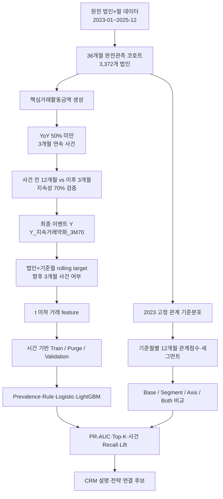

# 지속거래약화 모델링 총정리 및 재현 가이드

> 기준일: 2026-07-14  
> 구현 브랜치: `codex/segment-model-ablation`  
> 목적: 다른 팀원이 이 문서만으로 현재 모델링의 논리, 구현 위치, 결과, 한계를 이해하고 같은 실험을 재현할 수 있게 한다.

## 1. 한눈에 보는 현재 상태

현재까지 확정된 것은 `Y_지속거래약화_3M70` 이벤트 라벨이다. 이 Y는 실제 해지나 확정 휴면이 아니라 거래활동이 크게 줄고 회복되지 않은 상태를 식별하는 **지속거래약화 proxy**다.

이 이벤트를 기준월 `t`에서 미리 예측하기 위해 `Y_향후3개월_지속거래약화`라는 rolling target을 만들고, 고정 Logistic Regression과 LightGBM으로 시간 기반 탐색 실험을 수행했다. 이후 관계 세그먼트와 거래활동·수신·여신 관계점수를 LightGBM에 추가해 feature 효과를 비교했다.

현재 결론은 다음과 같다.

| 항목 | 현재 상태 | 해석 |
| --- | --- | --- |
| 최종 이벤트 Y | 확정 | `Y_지속거래약화_3M70` |
| 36개월 완전관측 코호트 | 재현 완료 | 3,372개 법인, 121,392행 |
| 최종 양성 이벤트 | 재현 완료 | 516개 법인, 코호트의 15.30% |
| rolling 예측 target | 탐색 구현 | 현재 프로젝트 지침에 따라 운영 확정 전 재승인 필요 |
| baseline 모델 | 탐색 완료 | 고정 Logistic Regression·LightGBM |
| 하이퍼파라미터 튜닝 | 미실시 | FLAML·Optuna·Validation 반복 튜닝 미사용 |
| 관계 세그먼트 feature | 탐색 완료 | Base 대비 일관된 성능 개선 없음 |
| SHAP·feature importance | baseline에 대해 완료 | 세그먼트 확장 모델에는 아직 미적용 |
| 최종 Test 성능 | 미확정 | feature 선택과 무관한 추가 시간 holdout 필요 |

> **중요:** 아래 모델 성과는 코드 재현이 가능한 탐색 결과다. 현재 프로젝트의 Modeling Gate에 따라 rolling target, 사건창, cooldown, 기준월, embargo를 재승인하기 전에는 최종 운영 성능이나 일반화 성능으로 발표하지 않는다.

## 2. 전체 데이터 흐름



## 3. 데이터와 코호트 계약

### 3.1 분석 기간과 원천 규모

실제 원천 CSV를 2026-07-14에 다시 읽어 확인한 결과다.

| 구분 | 행 수 | 법인 수 |
| --- | ---: | ---: |
| 원천 데이터 | 365,988 | 15,473 |
| 36개월 완전관측 코호트 | 121,392 | 3,372 |

완전관측 법인은 다음 조건을 모두 만족해야 한다.

- 기간이 정확히 2023-01~2025-12다.
- 법인별 고객-월이 정확히 36개다.
- 월이 중복 없이 연속되어 있다.
- 결측 고객-월을 임의로 생성하지 않는다.
- 결측 원천 금액을 활동 0으로 바꾸지 않는다.
- 음수 거래금액은 원천 오류로 처리한다.

### 3.2 이벤트 라벨에 필요한 원천 컬럼

```text
법인ID
기준년월
요구불입금금액
요구불출금금액
창구거래금액
인터넷뱅킹거래금액
스마트뱅킹거래금액
폰뱅킹거래금액
ATM거래금액
신용카드사용금액
체크카드사용금액
```

라벨 구현과 코호트 검증은 `src/preprocessing/persistent_transaction_weakening_labels.py`에 있다.

## 4. 최종 이벤트 Y: `Y_지속거래약화_3M70`

### 4.1 핵심거래활동금액

```text
입출금활동금액
= 요구불입금금액 + 요구불출금금액

채널활동금액
= 창구거래금액
  + 인터넷뱅킹거래금액
  + 스마트뱅킹거래금액
  + 폰뱅킹거래금액
  + ATM거래금액

카드활동금액
= 신용카드사용금액 + 체크카드사용금액

핵심거래활동금액
= 입출금활동금액 + 채널활동금액 + 카드활동금액
```

수신, 여신, 외환, 자동이체, 상품관계폭은 최종 Y 판정식에 포함하지 않는다. 이 변수들은 기준월까지의 feature 또는 결과 설명축으로만 검토한다.

### 4.2 YoY 50% 미만 감소

법인별 월 `t`에서 12개월 전과 비교한다.

```text
핵심거래_YoY_ratio(t)
= 핵심거래활동금액(t) / 핵심거래활동금액(t-12)

drop50(t) = 핵심거래_YoY_ratio(t) < 0.50
```

- 전년 동월 값이 0이면 ratio와 drop50을 판정하지 않는다.
- 필수 원천 금액이 결측이면 해당 월을 판정하지 않는다.
- ratio가 정확히 0.50이면 drop50이 아니다.

### 4.3 최초 3개월 연속 사건

`drop50=1`이 3개월 연속인 구간에서 세 번째 달이 사건월이다.

```text
t-2: drop50=1
t-1: drop50=1
t:   drop50=1  → 최초 사건월 t
```

- 감소가 시작된 첫 달이 아니라 조건이 완성된 세 번째 달이 사건월이다.
- 같은 연속 구간의 네 번째 이후 달은 새 사건이 아니다.
- 법인별 최초 사건만 사용한다.
- 회복 후 재발한 3개월 연속 구간도 추가 사건으로 세지 않는다.
- 사건 ID는 `법인ID+이벤트월`이다.

### 4.4 사건 이후 지속성 확인

```text
baseline12 = 이벤트월 직전 t-12~t-1의 12개월 평균
future3 = 이벤트월 직후 t+1~t+3의 3개월 평균
future3_to_baseline = future3 / baseline12
```

이벤트월 `t`는 baseline12와 future3 어느 쪽에도 포함하지 않는다.

```text
Y_지속거래약화_3M70 = 1
if
drop50이 3개월 연속 발생
AND
future3_to_baseline < 0.70
```

- ratio가 정확히 0.70이면 Y=0이다.
- baseline12가 0 이하이거나 미래 3개월이 부족하면 Y는 0이 아니라 결측이다.

### 4.5 실제 데이터 재현 결과

| 사건 구분 | 건수 |
| --- | ---: |
| 최초 3개월 연속 사건 후보 | 834 |
| 지속성 조건 충족 Y=1 | 516 |
| 지속성 조건 미충족 Y=0 | 231 |
| 미래창·분모 부족 등 Y 결측 | 87 |

양성 516개는 완전관측 법인 3,372개의 15.3025%이며 문서 기준 15.30%와 일치한다.

## 5. 탐색 rolling 예측 target

최종 이벤트 Y는 사건 이후 3개월까지 관측해야 확정되는 사후 라벨이다. 실제 조기관리 모델은 기준월 `t`에서 앞으로 발생할 사건을 예측해야 하므로 별도 target을 만들었다.

```text
Y_향후3개월_지속거래약화(t) = 1
if
t+1~t+3 중 Y_지속거래약화_3M70=1인 최초 사건이 존재
```

### 5.1 기준월 한 행의 의미

```text
1 row = 법인ID × 기준월 t
X = t까지 관측된 거래정보
y = t+1~t+3에 발생하는 최종 양성 사건 여부
```

예를 들어 기준월이 2024-09라면 사건 탐색월은 2024-10~2024-12다. 사건월이 2024-12일 수 있고 그 사건의 지속성을 2025-01~2025-03까지 확인해야 하므로 이 기준월의 라벨 관찰 종료월은 2025-03이다.

일반화하면 다음과 같다.

```text
예측 사건창 종료 = t+3
가장 늦은 사건의 지속성 확인 종료 = (t+3)+3 = t+6
label_end = t+6
```

### 5.2 위험집단 구성

현재 탐색 코드 `src/models/persistent_weakening_baseline.py`는 다음 행을 제외한다.

- 기준월이 2024-02 이전 또는 2025-06 이후인 행
- 기준월 자체가 `core_3m_event=1`인 행
- 법인의 최초 최종 양성 사건월과 그 이후 행

즉, 모델은 이미 최종 양성 사건이 발생한 법인을 다시 조기경보 대상으로 반복 평가하지 않는다.

> 코드의 최초 기준월 2024-02와 위험집단 제외 규칙은 탐색 실험의 현재 구현값이다. 현재 Modeling Gate에 따라 운영 확정 전 사건창·cooldown·학습 기준월과 함께 다시 승인해야 한다.

## 6. 누수 방지와 시간 분할

### 6.1 기본 누수 경계

| 구분 | 사용할 수 있는 정보 |
| --- | --- |
| Feature X | 기준월 `t`와 그 이전 정보 |
| Target y | `t+1` 이후 사건과 지속성 정보 |
| 금지 feature | 이벤트 이후 3개월 평균, `future3_to_baseline`, 미래 사건월·사건ID, target |

다음 컬럼은 모델 feature에 포함하지 않는다.

```text
Y_지속거래약화_3M70
Y_향후3개월_지속거래약화
이벤트이후3개월평균
future3_to_baseline
미래지속거래약화사건월
미래지속거래약화사건ID
지속거래약화사건ID
label_end
```

### 6.2 현재 탐색 시간 분할

| 구간 | 기준월 | 용도 | 행 수 | 양성 수 |
| --- | --- | --- | ---: | ---: |
| Train | 2024-02~2024-09 | 모델 학습 | 25,794 | 652 |
| Purge | 2024-10~2025-03 | 학습·평가 제외 | 18,280 | - |
| Validation | 2025-04~2025-06 | 시간 외 평가 | 8,839 | 220 |

- Train 양성률: 2.5277%
- Validation 양성률: 2.4890%
- Validation 고유 양성 사건: 117개
- 전체 모델링 패널: 52,913행, 3,372개 법인

### 6.3 왜 6개월 purge인가

마지막 Train 기준월 2024-09의 target은 가장 늦게 2024-12에 사건이 발생할 수 있고, 그 사건의 지속성을 2025-03까지 확인한다. 따라서 Train label이 사용하는 미래 정보는 2025-03까지 이어진다.

Validation을 2025-04부터 시작하면 다음 조건이 성립한다.

```text
max(Train label_end) = 2025-03
min(Validation 기준월) = 2025-04
max(Train label_end) < min(Validation 기준월)
```

Purge 월의 원천 거래정보는 Validation 기준월의 과거 feature를 계산할 때는 사용할 수 있다. 다만 그 월들을 별도 학습행이나 평가행으로 사용하지 않는다.

### 6.4 Validation 사용상의 한계

관계 feature의 최적 조합을 같은 Validation에서 선택했다. 따라서 이 Validation은 세그먼트 ablation 이후 완전히 손대지 않은 최종 Test가 아니다. 선택된 모델의 일반화 성능을 주장하려면 이후 추가 시간 구간 또는 별도 holdout이 필요하다.

## 7. 기존 거래활동 feature engineering

네 가지 거래축을 사용한다.

```text
핵심거래활동금액
입출금활동금액
채널활동금액
카드활동금액
```

각 축마다 다음 13개 feature를 만든다.

| feature 유형 | 설명 |
| --- | --- |
| `log1p_현재값` | 기준월 현재 규모 |
| `1개월변화율` | 전월 대비 변화율 |
| `YoY_ratio` | 12개월 전 대비 비율 |
| 최근 3개월 평균·표준편차·활성률 | 단기 수준·변동성·활동 지속성 |
| 최근 6개월 평균·표준편차·활성률 | 중기 수준·변동성·활동 지속성 |
| 최근 3개월/이전 6개월 비율 | 최근 변화와 이전 수준 비교 |
| 최근 3·6·12개월 기울기 | 단기·중기·장기 추세 |

네 축 × 13개 = 52개이며 다음 직접 신호 2개를 더해 Base는 총 54개다.

```text
현재drop50
현재drop50연속개월수
```

모든 rolling 계산은 법인별로 분리한다. 기준월 `t`의 feature는 `t`까지만 사용하며 다른 법인의 행이 같은 rolling 창에 섞이지 않는다.

## 8. baseline 모델과 직접신호 ablation

### 8.1 비교한 baseline

| 모델 | 설계 목적 |
| --- | --- |
| Prevalence | Train 양성률을 모든 행에 동일하게 부여하는 최저 기준선 |
| CurrentSignalRule | 현재 YoY와 drop50 연속기간으로 만든 고정 규칙 점수 |
| LogisticRegression | 선형 관계 기반 baseline |
| LogisticRegression_NoDirect | 직접 약화 신호 제거 후 선형 성능 확인 |
| LightGBM | 비선형·상호작용을 반영하는 주 baseline |
| LightGBM_NoDirect | 직접 신호 의존도를 제거한 LightGBM |

CurrentSignalRule은 다음과 같은 순위 점수를 사용한다.

```text
2 × min(drop50 연속개월수, 2)
+ I(핵심거래 YoY < 0.70)
+ max(1 - 핵심거래 YoY, 0)
```

이 점수는 확률 보정 모델이 아니라 단순 순위 규칙이다.

### 8.2 NoDirect에서 제거한 세 feature

```text
현재drop50
현재drop50연속개월수
YoY_ratio_핵심거래활동금액
```

따라서 feature 수는 Base 54개에서 NoDirect 51개로 줄어든다.

NoDirect는 모든 현재 약화정보를 제거한 모델이 아니다. 입출금·채널·카드 축별 YoY와 다른 최근 추세 feature는 남아 있다. 특히 입출금 YoY가 여전히 강한 feature이므로 NoDirect를 순수 장기예측 모델로 표현하지 않는다.

## 9. 관계 세그먼트와 관계축 feature

### 9.1 세 관계축

관계 feature에는 최종 Y 판정식보다 넓은 금융관계 정보를 사용한다.

```text
거래활동금액
= 입출금 + 채널 + 신용카드 + 체크카드

수신관계금액
= 요구불예금 + 거치식예금 + 적립식예금
  + 수익증권 + 신탁 + 퇴직연금 잔액

여신관계금액
= 운전자금대출잔액 + 시설자금대출잔액
```

### 9.2 기준월별 rolling 관계수준

```text
거래활동관계수준(t)
= median(log1p(거래활동금액), t-11~t)

수신관계수준(t)
= median(log1p(수신관계금액), t-11~t)

여신관계수준(t)
= median(log1p(여신관계금액), t-11~t)
```

각 기준월에는 정확히 과거 12개월이 모두 있을 때만 계산한다. 2024년 전체 세그먼트를 2024년 중간 기준월에 미리 붙이지 않는다.

### 9.3 2023 고정 기준분포

2023-01~2023-12의 법인별 관계수준을 고정 reference로 만든다. 이후 모든 기준월은 이 reference의 right-continuous 경험적 CDF로 0~1 점수를 받는다.

```text
거래활동점수
수신관계점수
여신관계점수
```

이후 월의 분포를 이용해 percentile을 다시 fit하지 않는다. 실제 모델링 패널에서 세 점수 범위는 0.0056~1.0이었다.

### 9.4 L30_H70_M15 세그먼트 규칙

우선순위는 다음과 같다.

1. 세 점수가 모두 0.30 이하이면 `저관계`
2. 두 개 이상 점수가 0.70 이상이면 `복합고관계`
3. 위 조건이 아니고 1위 점수와 2위 점수 차이가 0.15 이상이면 1위 축에 따라 `거래활동중심`, `수신중심`, `여신중심`
4. 나머지는 `균형·중간관계`

모델에는 다음 여섯 고정 one-hot을 사용한다.

```text
segment_저관계
segment_균형중간관계
segment_거래활동중심
segment_수신중심
segment_여신중심
segment_복합고관계
```

모든 모델링 행에서 여섯 dummy의 합은 정확히 1이어야 한다.

## 10. Base·Segment·Axis·Both 비교 설계

네 모델은 서로 다른 알고리즘이 아니다. 같은 고정 LightGBM에 넣는 feature만 바꾼 비교다.

| 모델 | feature 구성 | feature 수 | 확인 목적 |
| --- | --- | ---: | --- |
| `LightGBM_Base` | 기존 거래활동 feature | 54 | 기준 성능 |
| `LightGBM_Segment` | Base + 세그먼트 one-hot 6개 | 60 | 관계 유형의 추가 효과 |
| `LightGBM_Axis` | Base + 관계점수 3개 | 57 | 연속형 관계 강도의 추가 효과 |
| `LightGBM_Both` | Base + 관계점수 3개 + 세그먼트 6개 | 63 | 관계 강도와 유형의 결합 효과 |

Phase 1 선택 순서는 K=10% 지표에서 다음과 같이 고정했다.

1. PR-AUC
2. 동률이면 사건 Recall@10%
3. 다시 동률이면 행 Recall@10%
4. 다시 동률이면 추가 feature 수가 적은 모델

Phase 1에서 관계 feature가 선택되면 NoDirect에도 같은 관계 feature를 붙여 `LightGBM_NoDirect_Best`를 만든다. Base가 선택되면 의미가 중복되므로 `NoDirect_Best`를 만들지 않는다.

실제 실행에서는 `Both`가 PR-AUC 1위라 NoDirect+Both가 만들어졌다.

## 11. 고정 하이퍼파라미터

현재 실험은 feature 비교가 목적이므로 하이퍼파라미터 튜닝을 하지 않았다.

### 11.1 Logistic Regression

| 항목 | 값 |
| --- | --- |
| 결측 대체 | Train 중앙값 |
| scaling | Train에 StandardScaler fit 후 Validation transform |
| C | 1.0 |
| class weight | balanced |
| max iterations | 1,000 |
| random seed | 42 |

### 11.2 LightGBM

| 파라미터 | 값 |
| --- | ---: |
| `n_estimators` | 300 |
| `learning_rate` | 0.03 |
| `num_leaves` | 15 |
| `max_depth` | 5 |
| `min_child_samples` | 100 |
| `subsample` | 0.8 |
| `subsample_freq` | 1 |
| `colsample_bytree` | 0.8 |
| `reg_alpha` | 0.1 |
| `reg_lambda` | 1.0 |
| `class_weight` | balanced |
| `random_state` | 42 |
| `n_jobs` | 1 |
| deterministic | True |
| force column-wise | True |

FLAML, Optuna, random search, grid search는 사용하지 않았다. 이후 튜닝을 한다면 현재 Validation을 반복 사용하지 말고 Train 내부 시간 교차검증에서만 탐색해야 한다.

## 12. 평가 지표

양성률이 약 2.5%인 불균형 문제이므로 Accuracy를 주 지표로 사용하지 않는다.

| 지표 | 의미 |
| --- | --- |
| PR-AUC | 전체 점수 순위에서 양성 정밀도와 재현율의 균형 |
| Recall@K | 상위 K% 알림이 포착한 양성 법인×기준월 비율 |
| Precision@K | 상위 K% 알림 중 실제 양성 비율 |
| Lift@K | 상위 K% Precision ÷ 전체 양성률 |
| 사건 Recall@K | `법인ID+사건월` 고유 사건 중 상위 K%가 포착한 비율 |
| Lead1·2·3 Recall | 사건 1·2·3개월 전 양성행의 포착률 |
| 현재무감소 Recall | 현재 drop50 연속개월수가 0인 양성행 포착률 |
| Decile lift | 점수 10분위별 양성률과 전체 대비 lift |

Validation 8,839행의 상위 10% 알림 수는 `ceil(8,839×0.10)=884`다.

## 13. 실데이터 모델 결과

### 13.1 최초 baseline 결과

| 모델 | PR-AUC | Top 10% Recall | Top 10% Lift | 사건 Recall@10% |
| --- | ---: | ---: | ---: | ---: |
| Prevalence | 0.0249 | - | - | - |
| CurrentSignalRule | 0.1521 | 53.64% | 5.36 | 70.94% |
| LogisticRegression | 0.1360 | 55.45% | 5.54 | 70.94% |
| LogisticRegression_NoDirect | 0.0778 | 35.00% | 3.50 | 46.15% |
| LightGBM | **0.1970** | **61.82%** | **6.18** | **79.49%** |
| LightGBM_NoDirect | 0.1824 | 55.45% | 5.54 | 70.09% |

고정 LightGBM이 baseline 중 가장 높았다. NoDirect LightGBM도 PR-AUC 0.1824를 유지해 직접 신호를 제외해도 일부 예측력이 남았지만, 전체 LightGBM보다 종합 성능은 낮았다.

### 13.2 관계 feature ablation 결과

| 모델 | PR-AUC | Recall@10% | Precision@10% | Lift@10% | 사건 Recall@10% | Lead3 Recall | 현재무감소 Recall |
| --- | ---: | ---: | ---: | ---: | ---: | ---: | ---: |
| LightGBM_Base | 0.1970 | 61.82% | 15.38% | 6.18 | **79.49%** | 18.67% | 18.67% |
| LightGBM_Segment | 0.1940 | 60.45% | 15.05% | 6.04 | 76.92% | 16.00% | 16.00% |
| LightGBM_Axis | 0.1947 | **61.82%** | **15.38%** | **6.18** | 78.63% | 14.67% | 14.67% |
| LightGBM_Both | **0.1988** | 61.36% | 15.27% | 6.14 | 76.07% | 17.33% | 17.33% |
| LightGBM_NoDirect | 0.1824 | 55.45% | 13.80% | 5.54 | 70.09% | 22.67% | 22.67% |
| LightGBM_NoDirect_Best | 0.1865 | 57.27% | 14.25% | 5.73 | 68.38% | **24.00%** | **24.00%** |

### 13.3 결과 해석

`Both`는 Base보다 PR-AUC가 0.0017 높았지만 다음 guardrail은 낮아졌다.

- Recall@10%: 61.82% → 61.36%, 0.46%p 하락
- 사건 Recall@10%: 79.49% → 76.07%, 3.42%p 하락
- Lift@10%: 6.18 → 6.14 하락

Segment만 추가한 모델과 Axis만 추가한 모델도 Base보다 일관되게 우수하지 않았다. 따라서 현재 결과만으로 관계 세그먼트가 예측 성능을 개선했다고 결론 내리지 않는다.

NoDirect+Both는 NoDirect보다 PR-AUC와 행 Recall이 올라갔지만 사건 Recall은 낮아졌다. 현재무감소·Lead3 Recall은 24.00%로 높아졌으나, 동일 Validation에서 feature 조합을 선택했으므로 추가 시간 검증이 필요하다.

현재 가장 안전한 해석은 다음과 같다.

1. 예측 baseline은 `LightGBM_Base`를 유지한다.
2. 관계 세그먼트는 성능 향상 feature보다 CRM 설명·전략 분리 정보로 활용한다.
3. 세그먼트 feature를 최종 모델에 넣으려면 추가 시간 holdout에서 PR-AUC와 사건 Recall을 함께 재검증한다.

## 14. Feature importance와 SHAP

해석은 기존 `LightGBM`과 `LightGBM_NoDirect`에 대해 수행했다. Train으로 모델을 다시 fit하고 Validation 8,839행 전체에서 TreeSHAP을 계산했다.

| 모델 | Gain 1위 | Gain 비중 | SHAP 1위 | SHAP 비중 |
| --- | --- | ---: | --- | ---: |
| LightGBM | `YoY_ratio_핵심거래활동금액` | 24.84% | `YoY_ratio_핵심거래활동금액` | 8.27% |
| LightGBM_NoDirect | `YoY_ratio_입출금활동금액` | 31.76% | `YoY_ratio_입출금활동금액` | 12.38% |

주요 해석은 다음과 같다.

- 낮은 YoY가 위험 점수를 높이는 핵심 신호였다.
- 음의 12개월 기울기와 낮은 현재 거래금액도 위험 증가 방향이었다.
- 입출금·채널의 최근 6개월 변동성이 높은 행에서 위험 raw score가 증가하는 경향이 있었다.
- Gain importance는 트리가 분기에서 사용한 효용이고, mean absolute SHAP은 실제 Validation 행에서 기여한 평균 크기다.
- `현재drop50`는 Gain에서는 2위 7.77%였지만 mean absolute SHAP에서는 17위 2.18%였다. 두 중요도를 같은 의미로 해석하지 않는다.
- 세그먼트 확장 모델의 SHAP은 아직 산출하지 않았다.

## 15. 코드 구조

| 파일 | 책임 |
| --- | --- |
| `src/preprocessing/persistent_transaction_weakening_labels.py` | 코호트 검증, 핵심거래, YoY, 최초 사건, 지속성 Y |
| `src/preprocessing/run_persistent_transaction_weakening_labels.py` | 원천 CSV에서 라벨 패널·이벤트 CSV 생성 |
| `src/models/persistent_weakening_baseline.py` | rolling target, feature, 시간 분할, baseline 평가 |
| `src/models/run_persistent_weakening_baseline.py` | baseline end-to-end 실행 |
| `src/models/persistent_weakening_interpretation.py` | LightGBM importance·SHAP 계산과 차트 |
| `src/models/run_persistent_weakening_interpretation.py` | 모델 해석 end-to-end 실행 |
| `src/segmentation/relationship_segments.py` | 관계축, 고정 reference, rolling 점수, 세그먼트 |
| `src/models/segment_model_ablation.py` | 안전 결합, feature family, 고정 LightGBM 비교 |
| `src/models/run_segment_model_ablation.py` | 관계 feature ablation end-to-end 실행 |
| `tests/test_persistent_transaction_weakening_labels.py` | Y 경계값·결측·최초 사건 테스트 |
| `tests/test_persistent_weakening_modeling.py` | target·purge·누수·baseline 평가 테스트 |
| `tests/test_relationship_segments.py` | 관계수준·고정 기준·미래값 불변성 테스트 |
| `tests/test_segment_model_ablation.py` | one-to-one 결합·모델 동일행·선택 규칙 테스트 |

관계 feature ablation 코드는 현재 `codex/segment-model-ablation` 브랜치에 있다. 다른 팀원이 `develop`에서 실행하려면 이 브랜치가 먼저 병합되어야 한다.

## 16. 실행 환경과 재현 명령

### 16.1 환경 생성

```bash
conda env create -f environment.yml
conda activate final
```

주요 버전 계약은 Python 3.10, LightGBM 4.6.0, SHAP 0.49.1이다.

이하 명령의 `<CORPORATE_CSV>`는 원천 법인 익명데이터 CSV의 실제 경로로 바꾼다.

### 16.2 이벤트 Y 생성

```bash
python -m src.preprocessing.run_persistent_transaction_weakening_labels \
  --input "<CORPORATE_CSV>" \
  --output-dir outputs/persistent_transaction_weakening_labels
```

예상 출력:

```text
outputs/persistent_transaction_weakening_labels/
├── persistent_transaction_weakening_panel.csv
└── persistent_transaction_weakening_events.csv
```

확인해야 할 값은 완전관측 3,372개, 사건 후보 834개, Y=1 516개, Y=0 231개, Y 결측 87개다.

### 16.3 baseline 실행

```bash
python -m src.models.run_persistent_weakening_baseline \
  --input "<CORPORATE_CSV>" \
  --output-dir outputs/persistent_weakening_baseline
```

예상 출력:

```text
outputs/persistent_weakening_baseline/
├── modeling_panel.csv
├── validation_scores.csv
├── validation_metrics.csv
├── validation_lift.csv
└── segment_diagnostics.csv
```

baseline runner의 `segment_diagnostics.csv`는 이름과 달리 관계 세그먼트 결과가 아니라 모델×기준월별 행 수, 양성률, 평균 점수 진단이다.

### 16.4 Feature importance와 SHAP

```bash
python -m src.models.run_persistent_weakening_interpretation \
  --modeling-panel outputs/persistent_weakening_baseline/modeling_panel.csv \
  --output-dir outputs/persistent_weakening_interpretation
```

예상 출력:

```text
outputs/persistent_weakening_interpretation/
├── feature_importance.csv
├── shap_global_importance.csv
├── shap_local_top_rows.csv
├── feature_importance_gain.png
├── shap_global_importance.png
├── shap_beeswarm_lightgbm.png
└── shap_beeswarm_lightgbm_no_direct.png
```

### 16.5 관계 feature ablation

```bash
python -m src.models.run_segment_model_ablation \
  --input "<CORPORATE_CSV>" \
  --output-dir outputs/segment_model_ablation
```

예상 출력:

```text
outputs/segment_model_ablation/
├── segment_modeling_panel.csv
├── segment_validation_scores.csv
├── segment_validation_metrics.csv
├── segment_validation_lift.csv
├── segment_validation_diagnostics.csv
└── segment_feature_selection.csv
```

`outputs/`의 CSV와 이미지 산출물은 대용량·데이터 보안 때문에 Git에 커밋하지 않는다.

## 17. 자동 테스트와 누수 검증 체크리스트

전체 테스트 실행:

```bash
python -m pytest -q
```

다른 팀원이 재현할 때 다음을 모두 확인해야 한다.

### 데이터·Y

- [ ] 원천 15,473개 중 완전관측 법인이 3,372개다.
- [ ] 완전관측 패널이 121,392행이다.
- [ ] 법인×월 중복이 없다.
- [ ] 결측 고객-월과 결측 금액을 0으로 채우지 않았다.
- [ ] 최초 3개월 연속 사건 후보가 834개다.
- [ ] Y=1이 516개, Y=0이 231개, Y 결측이 87개다.
- [ ] 0.50은 drop50이 아니고 0.70은 Y=0이다.
- [ ] 같은 연속 구간과 회복 후 재발 사건을 중복 계산하지 않는다.

### Rolling target·시간 분할

- [ ] 기준월 `t` 이후 값이 feature에 포함되지 않는다.
- [ ] `label_end=t+6`이 정확히 계산된다.
- [ ] 최초 양성 사건월과 이후 기준월이 위험집단에서 제외된다.
- [ ] Train은 2024-02~2024-09, Validation은 2025-04~2025-06이다.
- [ ] Train 최대 label_end 2025-03이 Validation 시작 2025-04보다 빠르다.
- [ ] Train 25,794행·652양성, Validation 8,839행·220양성이 재현된다.

### Feature·모델

- [ ] 다른 법인의 행이 rolling feature에 섞이지 않는다.
- [ ] 미래 원천 값을 바꿔도 과거 기준월 feature가 변하지 않는다.
- [ ] target·future3·사건ID·label_end가 model feature에서 제외된다.
- [ ] Base feature가 54개, NoDirect가 51개다.
- [ ] 모든 LightGBM 모델이 같은 고정 파라미터와 random seed를 사용한다.
- [ ] 하이퍼파라미터 튜닝 결과를 현재 성과로 오해하지 않는다.

### 관계 feature

- [ ] 2023 기준분포가 이후 월에 다시 fit되지 않는다.
- [ ] 기준월의 관계수준은 정확히 `t-11~t`만 사용한다.
- [ ] 세그먼트 dummy 여섯 개의 행별 합이 1이다.
- [ ] 모델링 패널과 관계 feature가 `법인ID+기준년월` one-to-one으로 결합된다.
- [ ] 결합 전후 행 수, 행 순서, target, 사건ID, label_end가 같다.
- [ ] 여섯 비교 모델이 모두 동일한 Validation 8,839행을 사용한다.
- [ ] 저장된 metrics·lift·세그먼트 진단을 raw score에서 재계산했을 때 일치한다.

## 18. 해석 제한과 다음 진행 순서

### 18.1 하면 안 되는 해석

- 516개를 실제 해지 고객 또는 확정 휴면 고객이라고 부르지 않는다.
- 현재 Validation 성능을 최종 Test 성능이라고 부르지 않는다.
- `Both`의 PR-AUC 0.0017 상승만으로 세그먼트 효과가 입증됐다고 말하지 않는다.
- NoDirect를 현재 약화신호가 전혀 없는 순수 선행예측 모델이라고 말하지 않는다.
- 완전관측 3,372개 결과를 신규·단기관측·관측중단 법인 전체로 확대하지 않는다.

### 18.2 다음 진행 순서

1. 현재 프로젝트 지침에 맞춰 rolling target, 최초 사건 위험집단, cooldown, 기준월, embargo를 다시 승인한다.
2. 승인된 시간정책으로 모델링 패널을 재생성하고 동일 수치가 재현되는지 확인한다.
3. Train 내부 시간 교차검증 설계를 만든 뒤에만 LightGBM 하이퍼파라미터를 튜닝한다.
4. feature 선택에 사용하지 않은 추가 시간 holdout에서 Base와 후보 모델을 비교한다.
5. 업종·지역·등급·전담여부별 표본 수, 양성률, PR-AUC, Top-K 안정성을 확인한다.
6. 최종 모델이 확정된 뒤 SHAP을 다시 계산한다.
7. 예측 확률에 고객가치 대리지표를 결합해 CRM 관리 우선순위를 만든다.
8. 관계 세그먼트는 예측 입력 여부와 별개로 맞춤형 접촉·상품 전략에 연결한다.

## 19. 핵심 근거 문서

- 최종 프로젝트 설계: `financial_dormancy.md`
- 최종 Y 탐색 근거: `y_setting_pipeline.md`
- Y 구현 명세: `docs/superpowers/specs/2026-07-13-persistent-transaction-weakening-y-design.md`
- 모델 정의와 결과: `src/models/model.md`
- 세그먼트 모델 비교 설계: `docs/superpowers/specs/2026-07-14-segment-model-ablation-design.md`

문서 간 설명이 충돌하면 현재 프로젝트 지침과 최종 Y 계약을 우선한다. 특히 이벤트 Y의 확정 상태와 rolling 예측 모델의 탐색 상태를 혼동하지 않는다.
